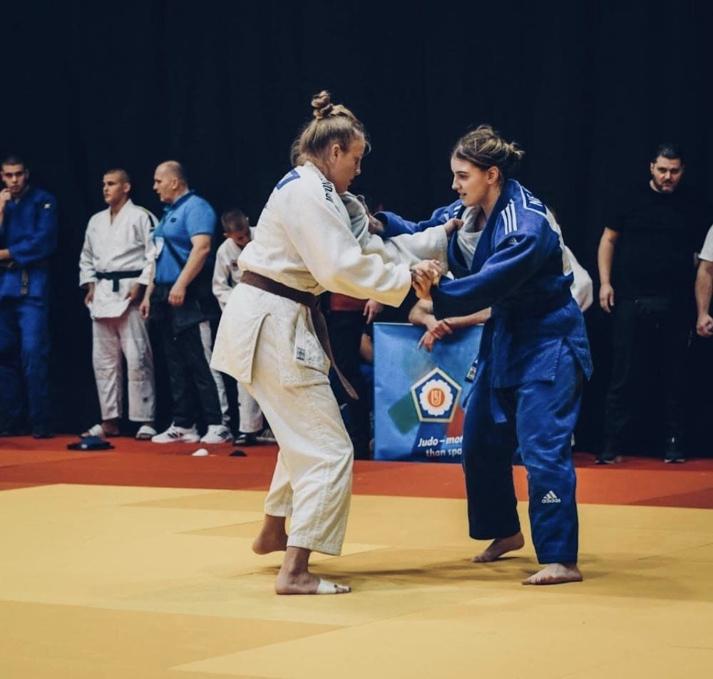

#### Borsa open 2023

Rezultati sa Internacionalnog judo turnira : Borsa open 2023, Mostar BiH

U najvećoj konkurenciji na jednom od najkonkurentnijih prestižnih svjetskih Judo turnira za 4 uzrasne kategorije (U11; 13; U15 i U18). Učešće je uzeo i naš klub sa 5 takmičara u konkurenciji 121 kluba iz 26 država sa svih krajeva svijeta gdje je učešće uzelo  1030 takmičara.
Rezultati i plasmani Naših takmičara

U15 
muškarci:
- Faruk Beširević;
   kat - 60kg; 7. mjesto 
- Ahmed Čopra;
   kat - 73kg; 5. mjesto
   
djevojke: 
- Nejra Žutić;
   kat - 63kg; 2. mjesto (srebro)

U18 
djevojke: 
- Naila Ibrahimović;
   kat - 70kg; 7. mjesto;
- Lejla Karić
   kat - 52kg; 7. mjesto;

 

 
 

 
 

 
 

 
 

 
 

 
 

 
 

 
 

 
