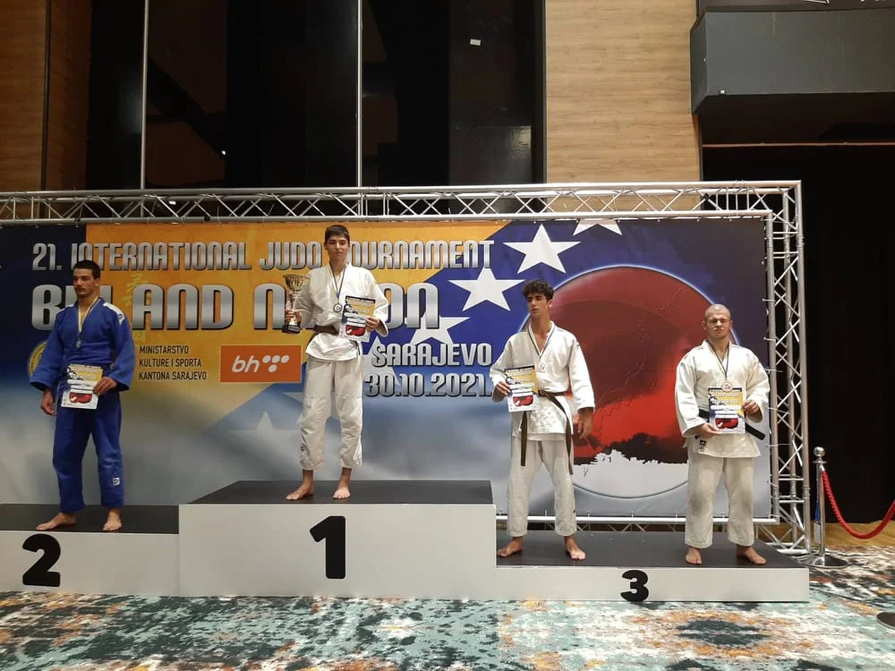

#### Internacionalni Judo Turnir BiH i Nippon - 31/10/2021

Dana 31. oktobra 2021. godine održan je Internacionalni judo turnir BiH i Nippon. Naši takmičari su ostvarili zapažene rezultate u različitim uzrastima:

##### Mlađi pioniri i pionirke U13

- Faruk Beširević (42kg)
    - 2. mjesto

- Ahmed Čopra (60kg)
    - 3. mjesto

##### Stariji pioniri i pionirke U16

- Naila Ibrahimović (57kg)
    - 3. mjesto

- Nadija Lučarević (63kg)
    - 5. mjesto

- Faruk Beširević (42kg)
    - 1. mjesto

- Ahmed Čopra (60kg)
    - 5. mjesto

- Nermin Subašić (66kg)
    - 5. mjesto

##### Kadeti i kadetkinje U18

- Amina Crnčalo (57kg)
    - 1. mjesto

- Bilal Ibragić (90kg)
    - 2. mjesto

- Hamza Mujić (81kg)
    - 5. mjesto

##### Juniori i juniorke U21

- Amina Crnčalo (57kg)
    - 1. mjesto

- Mirza Avdić (73kg)
    - 3. mjesto

Amina Crnčalo je proglašena za najbolju takmičarku ovog turnira i time je osvojila pehar, opravdavajući svoja dosadašnja postignuća.
