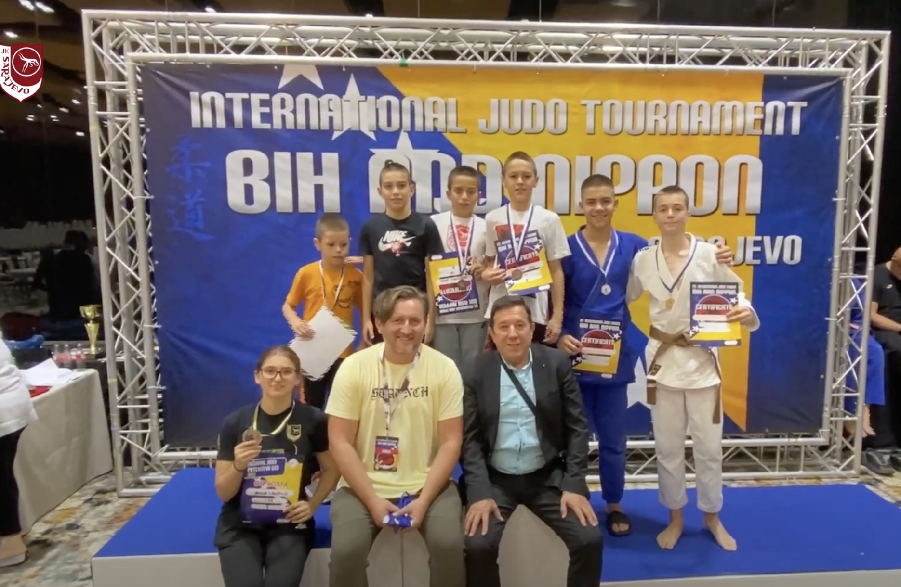
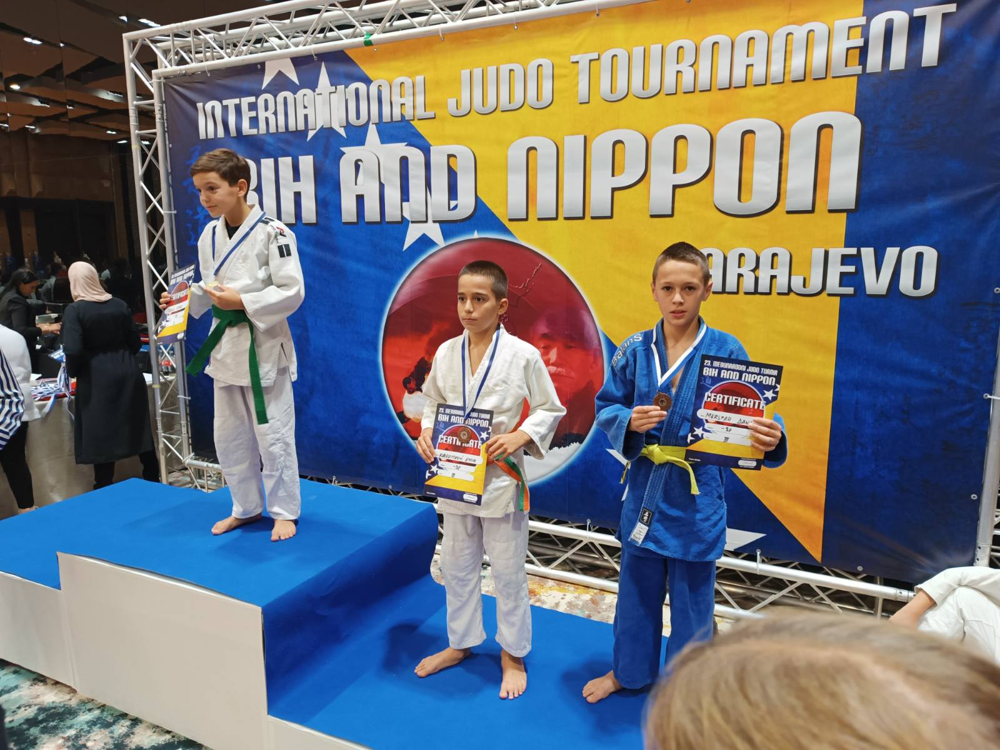
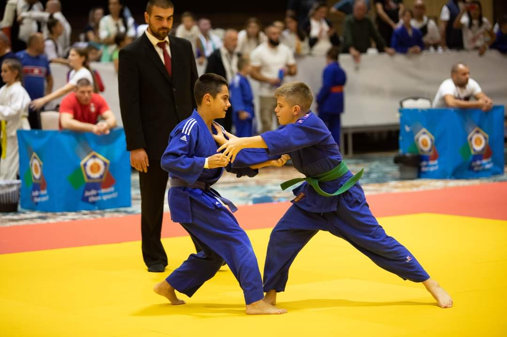
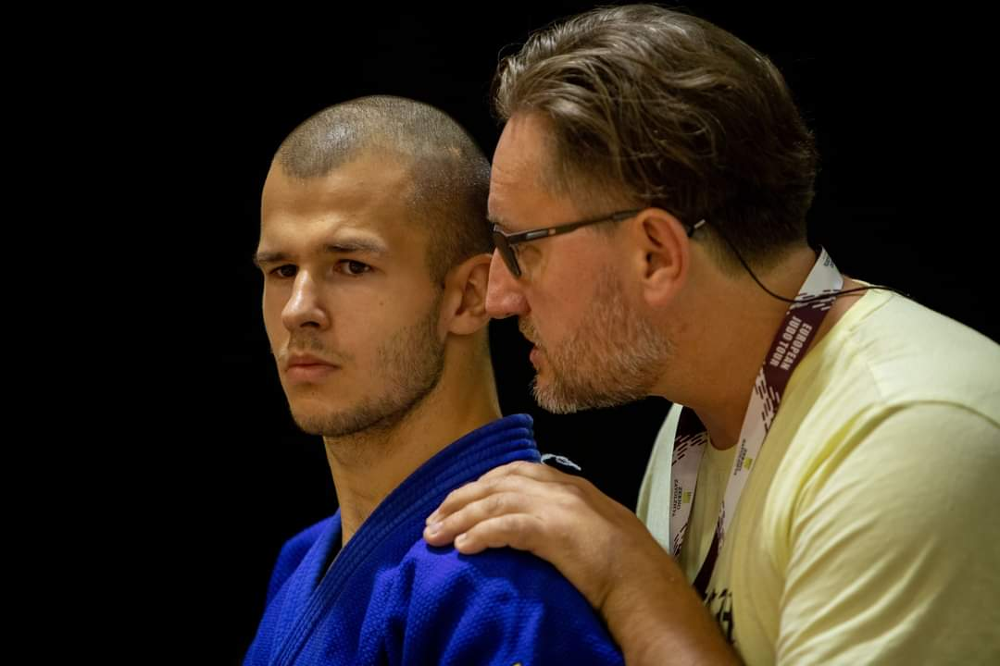
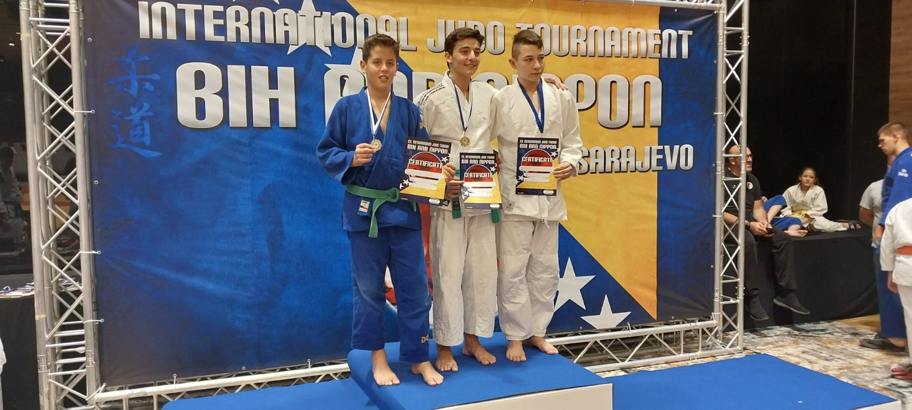
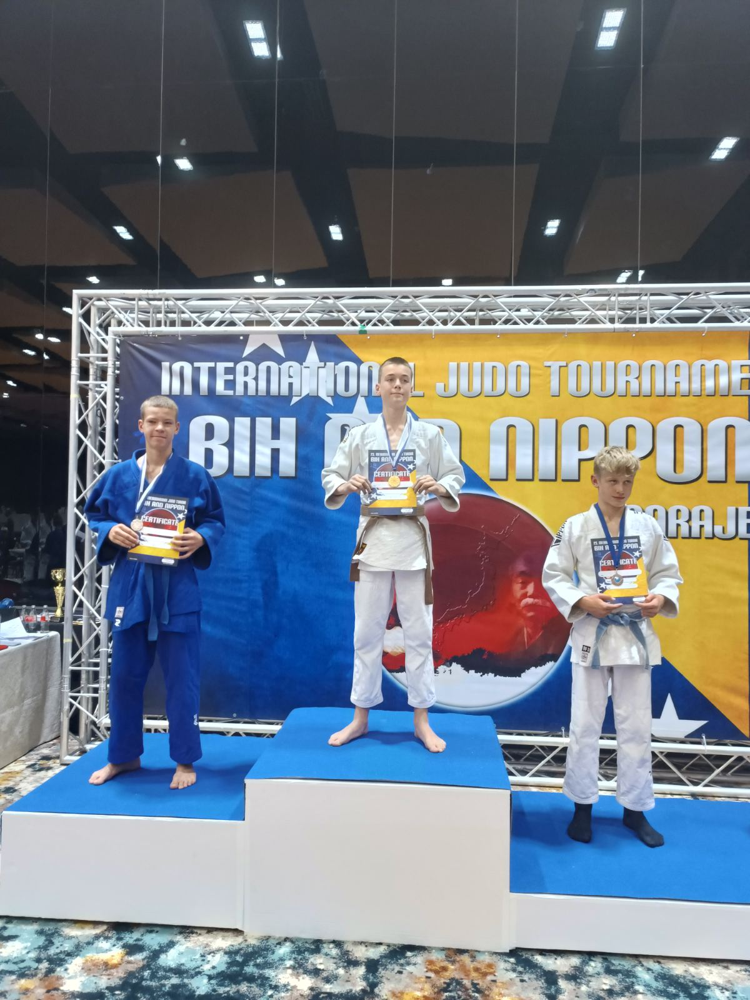
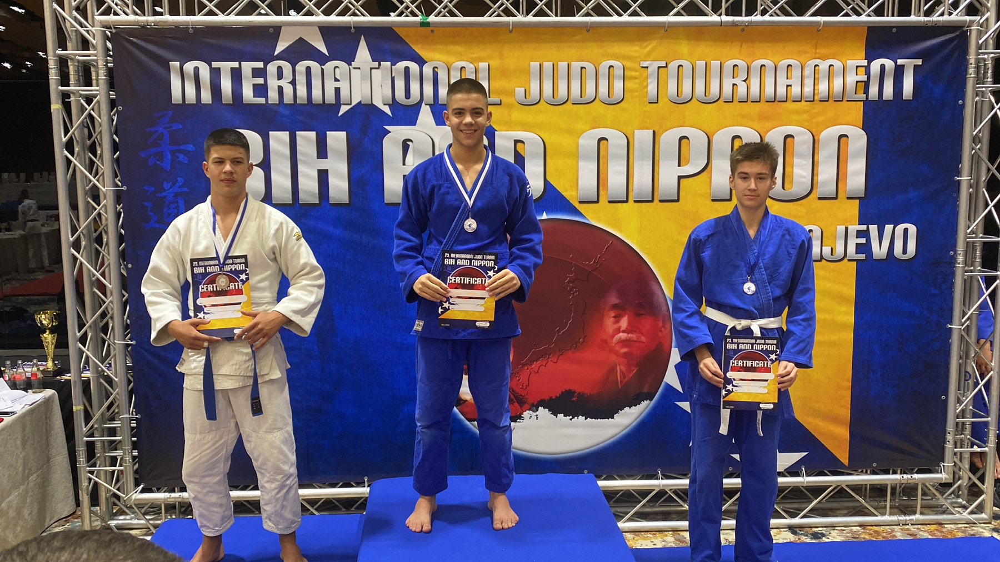
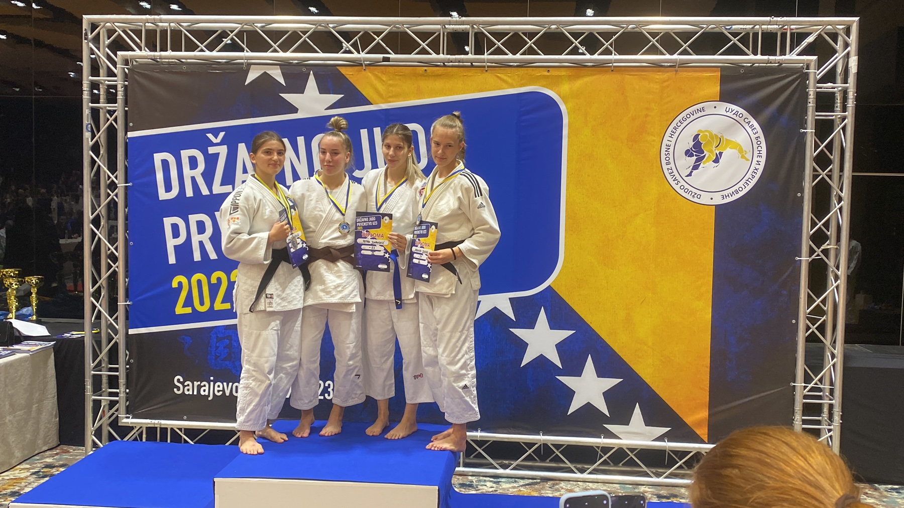
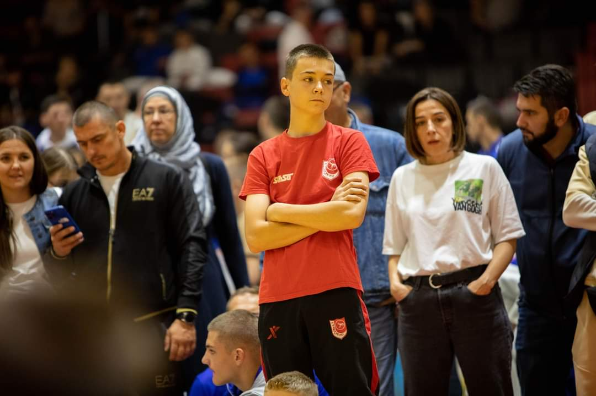

#### Rezultati sa Prvenstva BiH U23 i "BiH and Nippon" Međunarodnog turnira

U subotu, 30.09.2023, u dvorani hotela Hills, održano je prvenstvo Bosne i Hercegovine za takmičare do 23 godine i međunarodni judo turnir "BiH and Nippon". Naši takmičari su ostvarili izvanredne rezultate.

<iframe width="560" height="315" src="https://www.youtube.com/embed/Sg0qMHeNlJI?autoplay=1&mute=1" frameborder="0" allowfullscreen allow='autoplay'></iframe>

##### Prvenstvo BiH U23
- Amina Crnčalo (-57kg) - 2. mjesto
- Lejla Karić (-52kg) - 3. mjesto
- Mirza Avdić (-66kg) - 7. mjesto
- Arif Alibegovic (-73kg) - 9. mjesto

##### "BiH and Nippon"
##### U9
- Isa Močević (-31kg) - 3. mjesto
- Jusuf Konjević (-34kg) - 5. mjesto

##### U11
- Daris Meršpah (-30kg) - 2. mjesto
- Omar Kabahija (-38kg) - 7. mjesto

##### U13
- Danin Meršpah (-38kg) - 3. mjesto
- Emir Kasumović (-38kg) - 3. mjesto

##### U15
- Faruk Beširević (-55kg) - 1. mjesto
- Ahmed Čopra (-73kg) - 1. mjesto
- Omar Firdus (-66kg) - 2. mjesto

Čestitamo svim takmičarima na izvanrednim rezultatima na ovim važnim takmičenjima!
 
 

 
 

 
 

 
 

 
 

 
 

 
 

 
 

 
 