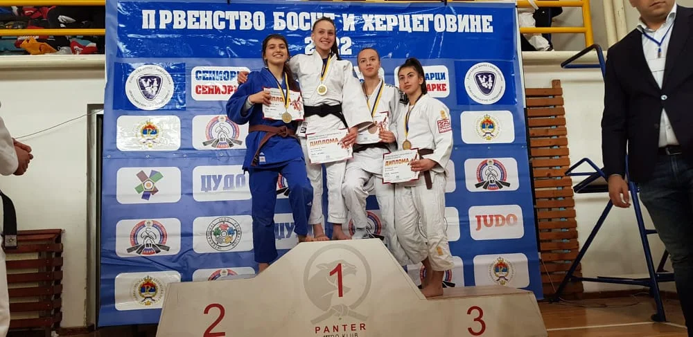

#### Državno Takmičenje za Seniore i Seniorke - Bijeljina 2022

Dana 6. marta 2022. godine, u Bijeljini je održano državno takmičenje za seniore i seniorke. Naša izvanredna takmičarka, Amina Crnčalo, koja ima samo 16 godina, ostvarila je izuzetan rezultat zauzevši 2. mjesto u seniorskoj konkurenciji.

Amina Crnčalo je ovim postignućem potvrdila svoje dosadašnje uspjehe i profesionalnost u svom radu. Njen trud i zalaganje su se isplatili na ovom državnom takmičenju, gdje je zasjala među starijim takmičarima i takmičarkama.

Čestitamo Amini Crnčalo na ovom sjajnom rezultatu i nadamo se njenim budućim uspjesima u svijetu juda!
