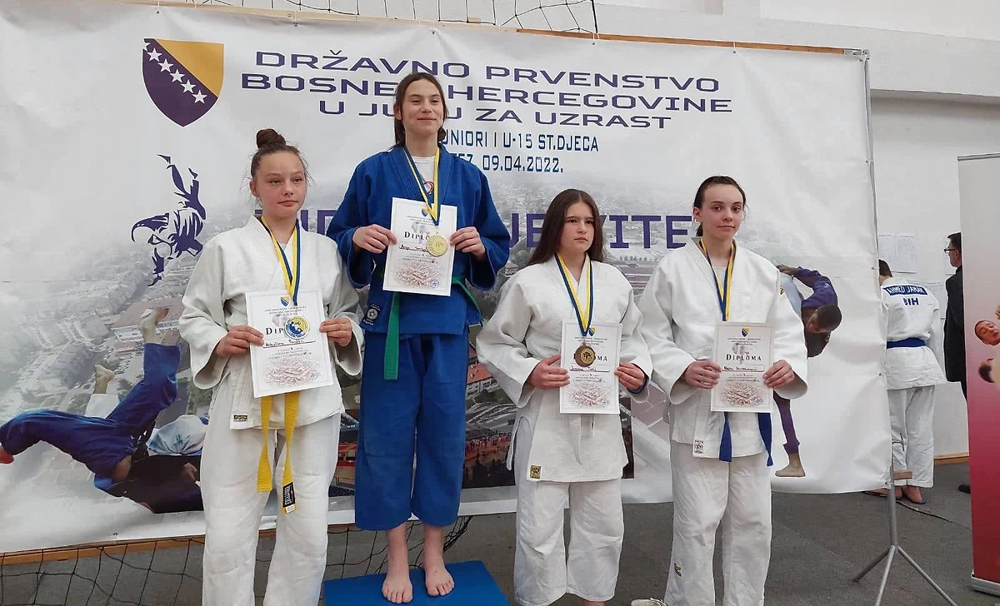

#### Državno Prvenstvo u Vitezu 2022

Dana 9. aprila 2022. godine, održano je državno prvenstvo u Vitezu za uzraste U21 i U15. Naši članovi su postigli značajne uspjehe na ovom takmičenju:

##### Starije Djevojčice i Dječaci U15:

- Naila Ibrahimović - 57kg: 3. mjesto
- Nejra Žutić + 63kg: 5. mjesto

- Faruk Beširević - 46kg: 7. mjesto
- Ahmed Čopra - 60kg: 7. mjesto
- Omar Mešić - 60kg: 3. mjesto

##### Juniorke i Juniori U21:

- Lejla Karić - 48kg: 5. mjesto
- Amina Crnčalo - 52kg: 2. mjesto

- Vahdet Karić - 66kg: 5. mjesto
- Bajram Plavović - 81kg: 7. mjesto
- Eldar Klepo - 100kg: 3. mjesto
- Tarik Salčin + 100kg: 7. mjesto

Čestitke našim članovima na ovim izvanrednim rezultatima na državnom prvenstvu u Vitezu 2022. Nastavite sa svojim odličnim radom i trudom!
