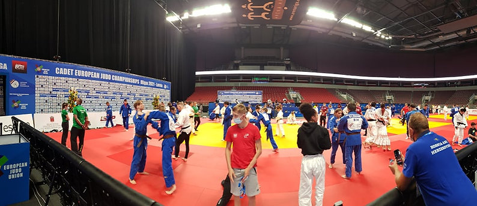
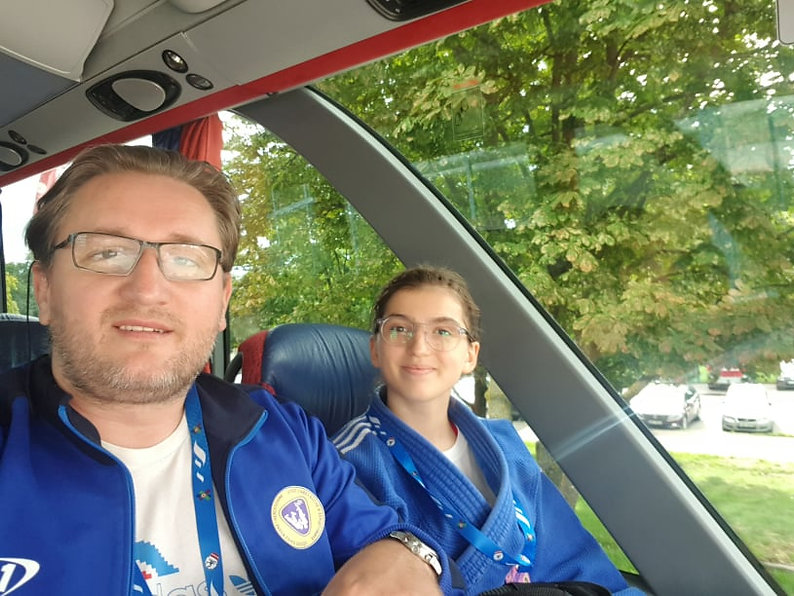
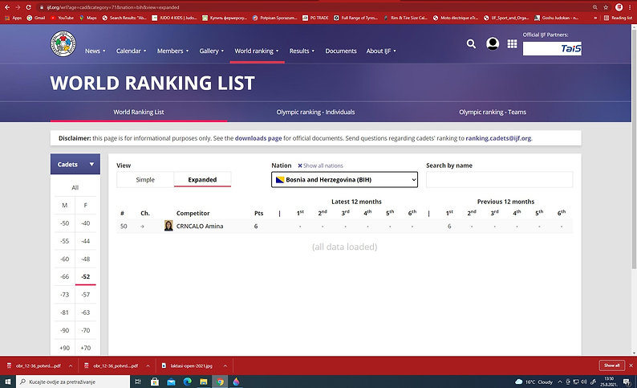

##### Amina Crnčalo - Uspjeh na Evropskom Judo Prvenstvu

Amina Crnčalo, u kategoriji -52kg, nastupila je za reprezentaciju Bosne i Hercegovine i ostvarila značajan rezultat, ulazeći u top 10 judoka u svojoj kategoriji.

Protekle sedmice, od 17. do 19. avgusta 2021. godine, u glavnom gradu Latvije - Riga, održano je Evropsko judo prvenstvo na kojem su nastupili judoke iz Bosne i Hercegovine. Naše judoke ostvarile su značajne rezultate, dok se ističe nastup Amine Crnčalo.

Amina Crnčalo je ušla u osminu finala, pobjedivši prvakinju Portugala - Carrico Angelu.

U drugom kolu, susrela se s aktuelnom viceprvakinjom Evrope i prvakinjom Italije, Carna Gijulija, i iako je izgubila, Gijulia je potvrdila svoj status osvajajući drugo mjesto na prvenstvu. U trećem meču za ulazak u polufinale, gdje bi se borila za bronzu, Amina Crnčalo je izgubila od prvakinje Turske - Arslan Meryem Iclal, u neizvjesnom meču koji se završio u Golden Scoreu. Unatoč porazu, Amina Crnčalo je pokazala izuzetno zalaganje, ostvarivši 2 bacanja koja nažalost nisu bodovala.

Važno je napomenuti da je ovo bilo prvo evropsko prvenstvo za Aminu Crnčalo i njen rezultat je ostao zapažen u povijesti juda u Bosni i Hercegovini.

Amina Crnčalo je ovim plasmanom dospijela na 50. poziciju na IJF cadet ranking listi, što predstavlja značajno priznanje za njen trud i rad. Ovi bodovi trebali bi joj biti nadahnuće za daljnje uspjehe.

Aminu Crnčalo je prema ovom uspjehu vodio stručnjak iz njenog kluba, trener Emir Ibragić.
