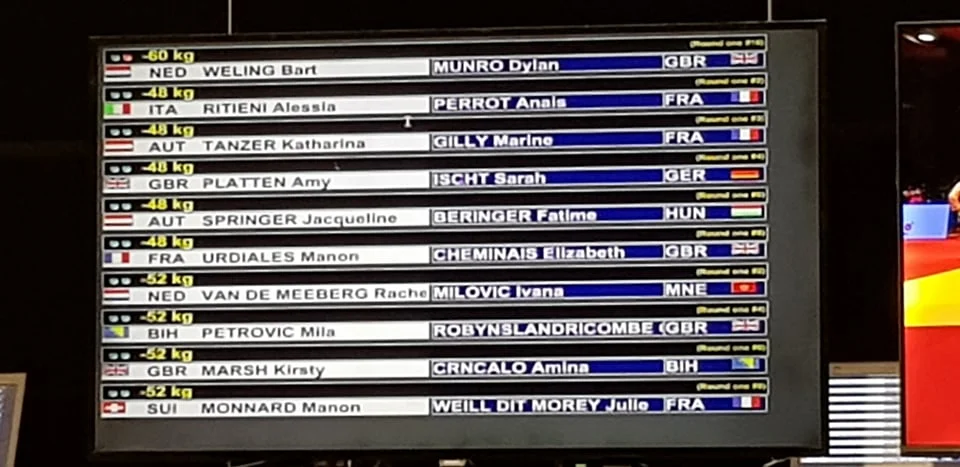
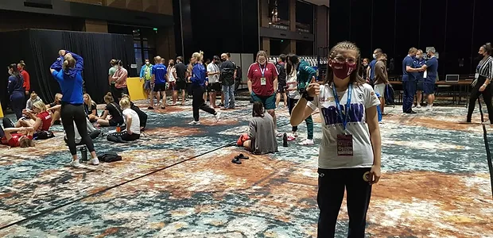

 

#### Evropsko Takmičenje "Sarajevo Open" - 18/09/2021

Evropsko takmičenje "Sarajevo Open" održano je 18/09/2021. godine u Sarajevu. Na ovom takmičenju sudjelovala je i naša takmičarka Amina Crnčalo.

 
Amina Crnčalo je ponovo imala IJF nastup u konkurenciji seniora na sarajevskom "Europa Open" takmičenju, i to u konkurenciji koja je bila starija i do 10 godina. Trener Emir Ibragić pružio je profesionalnu potporu i bio maksimalna podrška mladoj takmičarki.

Ostale takmičarke su dolazile iz različitih dijelova svijeta, a Amina Crnčalo je bila najmlađi takmičar. Zbog toga je proglašena najmlađom takmičarkom od strane IJF-a, a njezino ime je napisano zlatnom bojom na njihovoj stranici.

