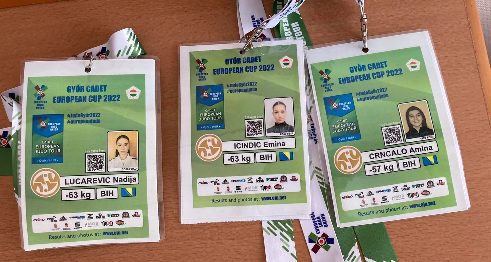

#### Rezultati sa posljednjeg Evropskog kupa za kadete/kadetkinje

Posljednji evropski kup za kadete i kadetkinje ove godine održan je u Mađarskoj, u Gyoru, u periodu od 18. do 19. novembra. Na ovom turniru učestvovalo je gotovo 400 takmičara iz dvadeset i devet država širom Evrope, uključujući i predstavnike iz Bosne i Hercegovine i našeg kluba.

Naš klub je imao tri takmičarke na ovom kupu:
- Lučarević Nadija (-63kg)
- Ičindić Emina (-63kg)
- Crnčalo Amina (-57kg)

Iako nisu osvojile medalje, naše takmičarke dostojno su predstavile boje našeg kluba. Amina je ostvarila pobjedu na ippon u prvoj borbi protiv Hoo Fedre iz Mađarske, ali je kasnije poražena od drugoplasirane Chloe Link iz Velike Britanije i Andrade Voice iz Rumunije.

Zahvaljujući ovom nastupu, koji je ujedno i njihovo prvo IJF pojavljivanje, Nadija i Emina će dobiti status perspektivnih sportistkinja, što će im u budućnosti olakšati trenažni proces i otvoriti vrata za nove uspjehe.

Želimo im puno sportske sreće i medalja na predstojećim IJF turnirima!
