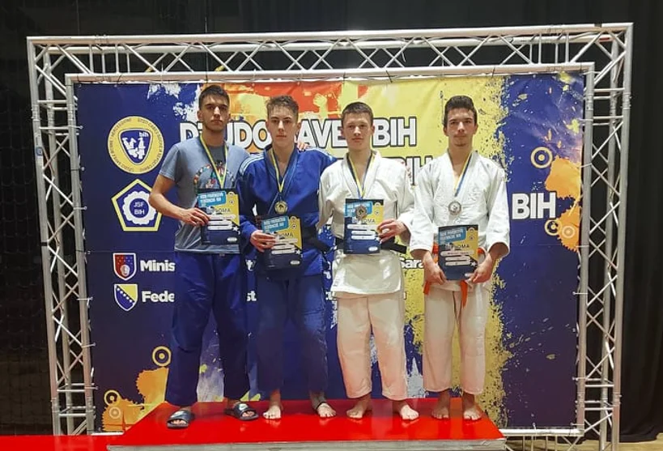

#### Rezultati Federalnog Takmičenja 2022 - Hotel Hills

Na Federalnom takmičenju održanom 27.02.2022. godine u Hotelu Hills, naši takmičari su pokazali izuzetnu spremnost i ostvarili impresivne rezultate. Evo pregleda njihovih postignuća:

##### Poletarci U11
- Ismail Plavović: -38kg - 7. mjesto

##### Stariji dječaci U15
1. Faruk Besirević: -46kg - 2. mjesto
2. Kemal Subašić: -55kg - 5. mjesto
3. Ahmed Čopra: -60kg - 7. mjesto

##### Kadeti U18
- Nermin Subašić: -66kg - 7. mjesto

##### Juniori U21
1. Vahdet Karić: -66kg - 5. mjesto
2. Bajram Plavović: -73kg - 2. mjesto
3. Bilal Ibragić: -90kg - 3. mjesto

##### Starije djevojčice U15
1. Naila Ibrahimović: -57kg - 1. mjesto
2. Nejra Žutić: +57kg - 2. mjesto

##### Kadetkinje U18
1. Lejla Karić: -48kg - 3. mjesto
2. Amina Crnčalo: -52kg - 1. mjesto
3. Esma Čopra: -57kg - 2. mjesto
4. Emina Ičindić: -57kg - 3. mjesto
5. Nejra Plavović: -63kg - 3. mjesto

##### Juniorke U21
1. Amina Crnčalo: -52kg - 3. mjesto
2. Esma Čopra: -57kg - 1. mjesto

Naši judisti su ostvarili značajne uspjehe na ovom takmičenju, a njihov trud i predanost sportu su nagrađeni brojnim medaljama i pozicijama na postolju. Čestitamo svim takmičarima na ovim izvanrednim rezultatima!
