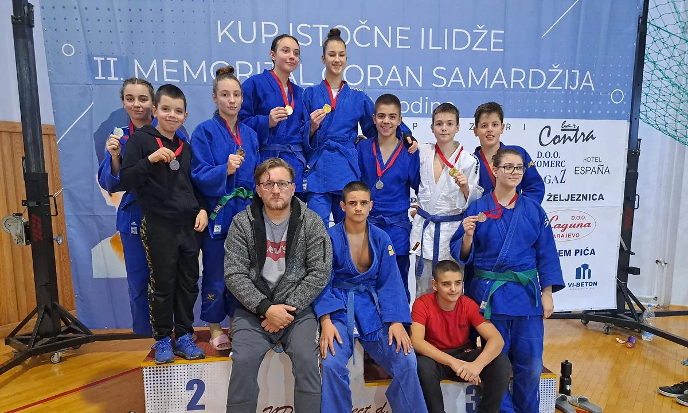

#### Rezultati sa 2. Međunarodnog takmičenja Goran Samardžija Istočna Ilidža

Dana 16. Novembra 2022. godine, naši takmičari nastupili su na 2. Međunarodnom takmičenju Goran Samardžija Istočna Ilidža i osvojili sljedeća odličja:

##### U18
- Amina Crnčalo (-57kg) – 1. mjesto
- Lejla Karić (-52kg) – 2. mjesto
- Emina Ičindić (-63kg) – 1. mjesto
- Esma Čopra (-63kg) – 2. mjesto
- Nermin Subašić (-66kg) – 5. mjesto

##### U15
- Naila Ibrahimović (-63kg) – 1. mjesto
- Nejra Žutić (+63kg) – 2. mjesto
- Ahmed Čopra (-66kg) – 2. mjesto
- Faruk Beširević (-50kg) – 1. mjesto
- Kemal Subašić (-60kg) – 5. mjesto

##### U13
- Omar Firdus (-60kg) – 2. mjesto

##### U11
- Benjamin Zuković (-42kg) - 3. mjesto

Čestitke našim takmičarima na ovim izvanrednim rezultatima!
