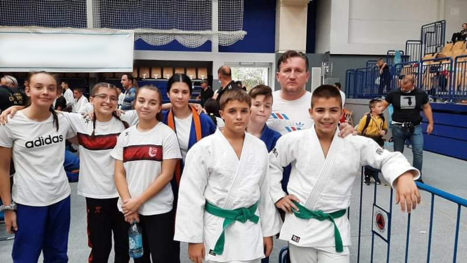

 

Dana 12. septembra 2021. godine održano je takmičenje u sportskoj dvorani Goran Čengić na Grbavici, gdje su naši takmičari ostvarili sljedeće uspjehe:
**Trener: Emir Ibragić**

 

##### Uzrast U11-kategorija -34kg:

- Benjamin Zuković
    - 5. mjesto

##### Uzrast U11-kategorija -42kg:

- Faruk Beširević
    - 5. mjesto

##### Uzrast U11-kategorija -55kg:

- Fatih Čebirić
    - 2. mjesto

##### Uzrast U13-kategorija -42kg:

- Faruk Beširević
    - 1. mjesto

##### Uzrast U13-kategorija -50kg:

- Kemal Subašić
    - 5. mjesto

##### Uzrast U13-kategorija -55kg:

- Omar Mešić
    - 7. mjesto

##### Uzrast U13-kategorija -60kg:

- Ahmed Čopra
    - 7. mjesto

##### Uzrast U18-kategorija -60kg:

- Nermin Subašić
    - 5. mjesto

##### Uzrast U18-kategorija -81kg:

- Hamza Mujić
    - 5. mjesto

##### Uzrast U15-kategorija -57kg:

- Naila Ibrahimović
    - 3. mjesto

- Nadija Lučarević
    - 5. mjesto

##### Uzrast U18-kategorija -52kg:

- Amina Crnčalo
    - 1. mjesto

##### Uzrast U18-kategorija -57kg:

- Emina Ičindić
    - 2. mjesto

- Esma Čopra
    - 5. mjesto
