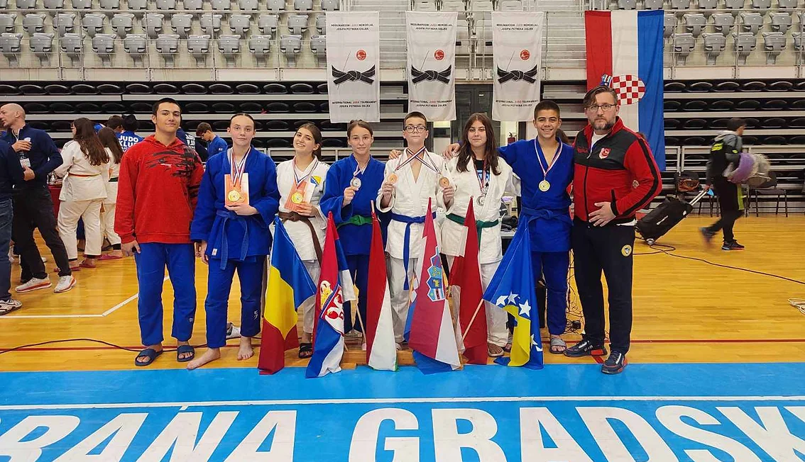

#### Rezultati na Međunarodnom Judo turniru Josip Potnek

Naši takmičari nastupili su na Međunarodnom Judo turniru Josip Potnek, održanom 29. oktobra 2022. godine, i ostvarili impresivne rezultate u različitim uzrastima:

##### U15
- Naila Ibrahimović (-63kg) – 1. mjesto
- Nejra Žutić (+63kg) – 2. mjesto
- Ahmed Čopra (-66kg) – 1. mjesto
- Faruk Beširević (-50kg) – 3. mjesto

##### U18
- Amina Crnčalo (-57kg) – 1. mjesto
- Lejla Karić (-52kg) – 2. mjesto
- Naila Ibrahimović (-63kg) – 3. mjesto
- Emad Čoko (-73kg) – 5. mjesto
- Faruk Beširević (-50kg) – 3. mjesto
- Ahmed Čopra (-66kg) – 5. mjesto
