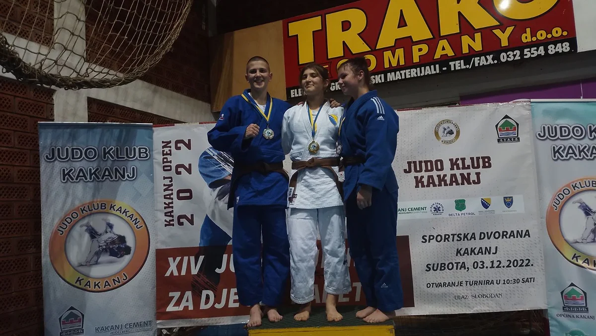

#### Rezultati sa Međunarodnog judo turnira "Kakanj Open"

Kao i prethodnih godina, naš klub je nastavio s tradicijom odlaska na međunarodni judo turnir "Kakanj Open," koji se ove godine održao 3. decembra. Nastupivši sa 10 takmičara, osvojili smo dva zlata, dva srebra, te četiri bronze.

##### U18
- Lejla Karić (52kg) - 1. mjesto
- Amina Crnčalo (57kg) - 1. mjesto
- Faruk Beširević (50kg) - 3. mjesto
- Ahmed Čopra (66kg) - 2. mjesto
- Nermin Subašić (66kg) - 3. mjesto

##### U15
- Nejra Žutić (+63kg) - 3. mjesto
- Faruk Beširević (50kg) - 1. mjesto
- Ahmed Čopra (66kg) - 3. mjesto

##### U11
- Benjamin Zuković (42kg) - 7. mjesto

##### U13
- Omar Firdus (60kg) - 2. mjesto

Čestitamo našim judokama na ovim izvanrednim rezultatima i želimo im puno sreće na predstojećem takmičenju u Vitezu!
