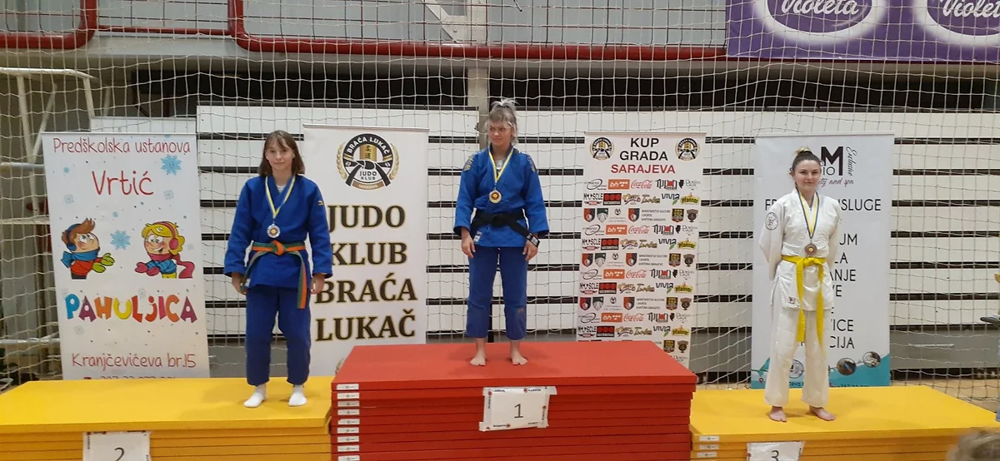

#### Rezultati Takmičenja 12/06/2022

Dana 12. juna 2022. godine održano je takmičenje u dvorani Amel Bećković, gdje su naši takmičari ostvarili značajne rezultate u različitim uzrastima:

##### Mlađi Poletarci i Poletarke U9

- Rijad Kolar - 34kg: 2. mjesto

##### Stariji Poletarci i Poletarke U11

- Benjamin Zuković: 3. mjesto

##### Stariji Dječaci i Djevojčice U15

- Faruk Beširević - 46kg: 1. mjesto
- Omar Mešić - 60kg: 5. mjesto
- Ahmed Čopra - 66kg: 5. mjesto

##### Kadeti i Kadetkinje U18

- Lejla Karić - 48kg: 2. mjesto
- Amina Crnčalo - 57kg: 1. mjesto
- Emad Čoko - 73kg: 5. mjesto
- Eldar Klepo +90kg: 1. mjesto

Naši takmičari su pokazali izvanredan kvalitet i ostvarili odlične rezultate, te zaslužili pehar za drugu najbolju ekipu u uzrastu U18. Čestitke svim takmičarima na njihovim impresivnim uspjesima!
