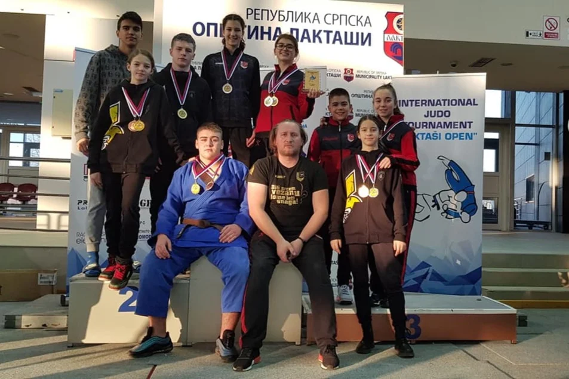

 

##### Internacionalno takmičenje u Laktašima je održano 17. i 18. februara 2021. godine, gdje su naši judogi ostvarili velike uspjehe.
 

**Trener: Emir Ibragić**

 
 

#### Uzrast U13-kategorija -42kg:
- Faruk Beširević - peti (pobijedio u dva meča ipponom, dva izgubio, izgubio za bronzu u zadnjem meču)

#### Uzrast U13-kategorija -50kg:
- Fatih Čebirić - sedmi

#### Uzrast U13-kategorija -60kg:
- Omar Firdus - peti (pobijedio u dva meča, a dva izgubio za bronzu u zadnjem meču)
- Ahmed Čopra - bronca

#### Uzrast U15-kategorija -50kg:
- Kemal Subašić - sedmi

#### Uzrast U18-kategorija -90kg:
- Eldar Klepo - bronca

#### Uzrast U21-kategorija -90kg:
- Eldar Klepo - šampion
- Bajram Plavović - deveti

#### Uzrast U8-kategorija -28kg:
- Zehra Čebirić - vice šampion

#### Uzrast U15-kategorija -52kg:
- Naila Ibrahimović - vice šampion
- Nadija Lučarević - pobijedila u dva meča ipponom

#### Uzrast U13-kategorija +57kg:
- Nejra Žutić - šampion

#### Uzrast U18-kategorija -52kg:
- Emina Ičindić - vice šampion

#### Uzrast U18-kategorija -57kg:
- Amina Crnčalo - šampion
- Esma Čopra - vice šampion

#### Uzrast U21-kategorija -57kg:
- Amina Crnčalo - šampion
- Esma Čopra - bronca

