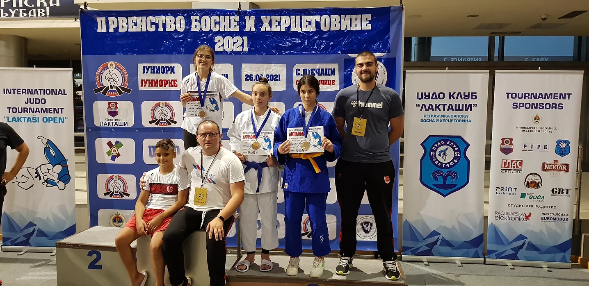

U Laktašima, 26/06/2021, održano je prvenstvo države za Juniore i Starije Pionire, gdje su judoke JK Sarajeva ostvarili veoma impresivne rezultate.

Sve naše judoke su briljirale u svojim kategorijama, gdje su pokazali impresivne rezultate, koje navodimo u nastavku teksta.

##### UZRAST U18 - Juniorke

1. Amina Crnčalo
    - Kategorija: -52kg, Viceprvak (Srebro)

##### UZRAST U15 - Starije Pionirke

2. Naila Ibrahimović
    - Kategorija: -52kg, Viceprvak (Srebro)

3. Nadija Lucarević
    - Kategorija: -63kg, Treća (Bronza)

##### UZRAST U15 - Stariji Pioniri

4. Kemal Subasic
    - Kategorija: -50kg, Sedmi

5. Omar Mesic
    - Kategorija: -55kg, Sedmi

