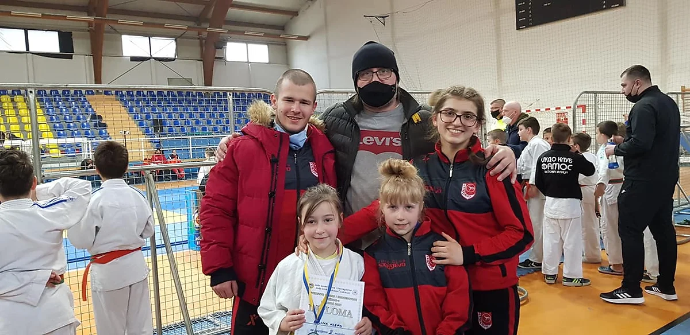

##### Proteklog vikenda, 20.03.2021 (subota), u Lukavcu održano je državno prvenstvo za seniore i seniorke, kao i za uzrast U11 poleraca i poletarki. Na ovom takmičenju su nastupila 4 takmičara iz našeg kluba - 2 u uzrastu seniora i 2 u U11.

**Trener: Emir Ibragić**

#### Seniorke:

**UZRAST: Seniorke**

1. Amina Crnčalo
    - Kategorija: -57kg, Viceprvak države (srebro), izgubila na kazne u finalu

##### U11:

**UZRAST U11 - Poletarke**

3. Eldina Klepo
    - Kategorija: -25kg, Viceprvak države (Srebro)

4. Zehra Čebirić
    - Kategorija: -28kg, 5 mjesto, izgubila u borbi za bronzu

#### Seniori:

**UZRAST: Seniori**

1. Mirza Avdić
    - Kategorija: -81kg, 7 mjesto
