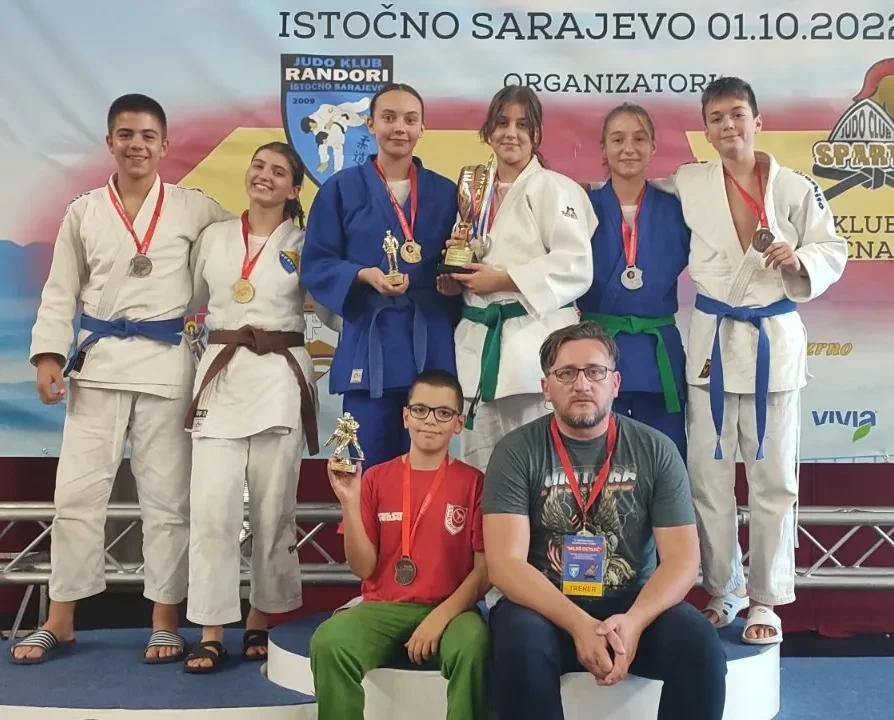

#### Rezultati na 2. Međunarodnom turniru Miloš Ostojić

Naši takmičari su ponovno briljirali na 2. Međunarodnom turniru Miloš Ostojić održanom 1.10.2022. godine, ostvarivši impresivne rezultate u različitim uzrastima:

##### U15
- Naila Ibrahimović (-63kg) – 1. mjesto, osvojen pehar za najbolju stariju djevojčicu
- Nejra Žutić (+63kg) – 2. mjesto
- Ahmed Čopra (-66kg) – 3. mjesto
- Faruk Beširević (-50kg) – 5. mjesto

##### U18
- Amina Crnčalo (-57kg) – 1. mjesto, osvojen pehar
- Lejla Karić (-52kg) – 2. mjesto
- Faruk Beširević (-50kg) – 3. mjesto

##### U11
- Benjamin Zuković (-42kg) - 3. mjesto
