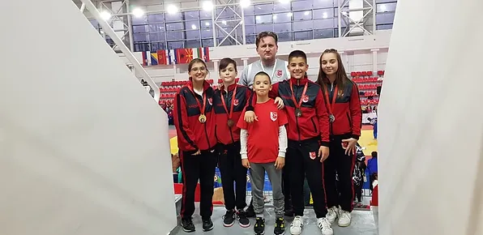
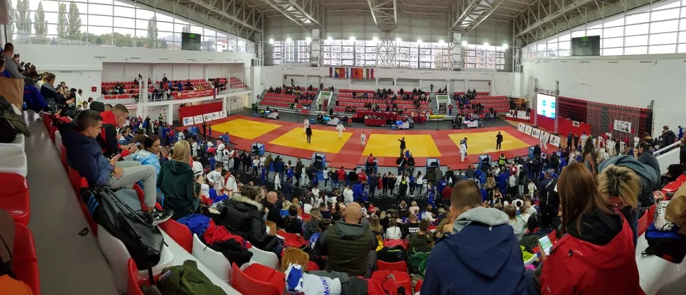

##### Dana 9. oktobra 2021. godine održan je Međunarodni Memorijalni Turnir Miloš Ostojić. Naši takmičari ostvarili su sljedeće rezultate:

- Nadija Lučarević (U15 -63kg)
    - Srebro

- Naila Ibrahimović (U15 -57kg)
    - Bronza

- Amina Crnčalo (U18 -57kg)
    - Zlato

- Esma Čopra (U18 -57kg)
    - Srebro

- Benjamin Kedžalić (U11 -42kg)
    - Srebro

- Faruk Beširević (U13 -42kg)
    - Bronza

- Ahmed Čopra (U13 -60kg)
    - Bronza

- Faruk Beširević (U15 -42kg)
    - Bronza

