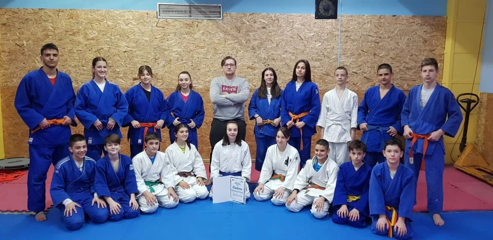

##### Priznanje za Perspektivnog Sportistu 2022 - Naila Ibrahimović

Naila Ibrahimović, dugogodišnja takmičarka našeg kluba, nedavno je nagrađena titulom "Perspektivnog Sportiste 2022". Ova prestižna nagrada dolazi kao rezultat njenog predanog truda i zalaganja na treninzima, kao i impresivnih uspjeha na mnogobrojnim turnirima i takmičenjima.

Biti perspektivni sportista zahtijeva veliku odlučnost i posvećenost, a Naila je dokazala da je sposobna za to. Ona je višestruki prvak Bosne i Hercegovine u raznim selekcijama, osvojivši oko 80 sjajnih odličija, uključujući regionalna, internacionalna i domaća takmičenja.

Naila se pridružuje svojim klupskim kolegama koji su također nosili ovu prestižnu titulu, uključujući Nasira Radaču, Edyja Merdana, i Aminu Crnčalo. Ova nagrada svjedoči o njenom izuzetnom talentu i predanosti sportu, te smo ponosni što imamo takvog sportistu u našem klubu.
