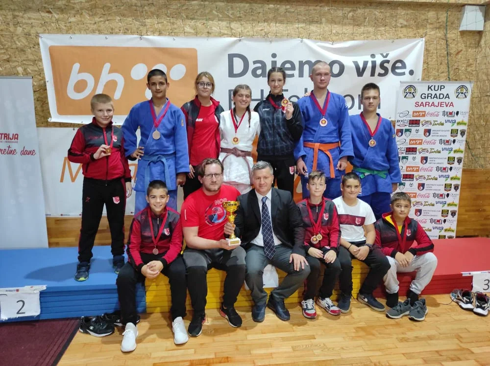

##### Osvojen Treći Internacionalni Judo Turnir "Kup Grada Sarajeva"

Naše judoke su zasluženo osvojile treći Internacionalni Judo Turnir "Kup Grada Sarajeva", na kojem je nastupilo preko 300 klubskih takmičara iz Bosne i Hercegovine, Slovenije, Hrvatske i Crne Gore. Naši judoke ponovo briljirale i osvojile pehar za najbolju ekipu do 18 godina.

##### Uzrast U9-kategorija -36kg:

1. Rijad Kolar
    - 3. mjesto (Bronza)

##### Uzrast U13-kategorija -42kg:

2. Faruk Beširević
    - 1. mjesto (Zlato)

##### Uzrast U13-kategorija -55kg:

3. Fatih Čebirić
    - 3. mjesto (Bronza)

##### Uzrast U13-kategorija -60kg:

4. Ahmed Čopra
    - 3. mjesto (Bronza)

##### Uzrast U15-kategorija -42kg:

5. Faruk Beširević
    - 1. mjesto (Srebro)

##### Uzrast U15-kategorija -55kg:

6. Omar Mešić
    - 3. mjesto (Bronza)

7. Kemal Subašić
    - 5. mjesto

##### Uzrast U18-kategorija -66kg:

8. Nermin Subašić
    - 3. mjesto (Bronza)

##### Uzrast U18-kategorija -81kg:

9. Hamza Mujić
    - 3. mjesto (Bronza)

##### Uzrast U18-kategorija -90kg:

10. Bilal Ibragić
    - 3. mjesto (Bronza)

##### Uzrast U18-kategorija +90kg:

11. Eldar Klepo
    - 1. mjesto (Zlato)

##### Uzrast U15-kategorija -57kg:

12. Naila Ibrahimović
    - 2. mjesto (Srebro)

##### Uzrast U18-kategorija -52kg:

13. Amina Crnčalo
    - 1. mjesto (Zlato)

##### Uzrast U18-kategorija -57kg:

14. Emina Ičindić
    - 1. mjesto (Zlato)

Čestitke ekipi i treneru Emiru Ibagiću!
