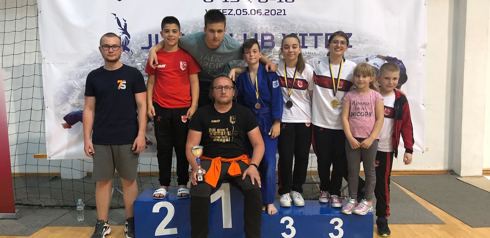

Državno takmičenje u Vitezu održano je 05/06/2021. godine, gdje su naši judogi ostvarili zapažene rezultate.

##### Uzrast U13 - Mlađi Pioniri

1. Faruk Beširević
    - Kategorija: -42kg
    - 3. mjesto (Bronza)

2. Fatih Čebirić
    - Kategorija: -50kg
    - 7. mjesto

3. Ahmed Čopra
    - Kategorija: -60kg
    - 5. mjesto

4. Omar Firdus
    - Kategorija: -55kg
    - 7. mjesto

#####  Uzrast U13 - Mlađe Pionirke

5. Nejra Žutić
    - Kategorija: +57kg
    - 1. mjesto (Zlato)

#####  Uzrast U18 - Kadetkinje

(Ekipno treće na Prvenstvu države)

4. Amina Crnčalo
    - Kategorija: -52kg
    - 1. mjesto (Zlato)

5. Emina Ičindić
    - Kategorija: -57kg
    - 3. mjesto (Bronza)

6. Esma Čopra
    - Kategorija: -57kg
    - 3. mjesto (Bronza)

#####  Uzrast U18 - Kadeti

7. Hamza Mujić
    - Kategorija: -90kg
    - 7. mjesto

8. Bilal Ibragić
    - Kategorija: -90kg
    - 7. mjesto

9. Eldar Klepo
    - Kategorija: -90kg
    - 5. mjesto
