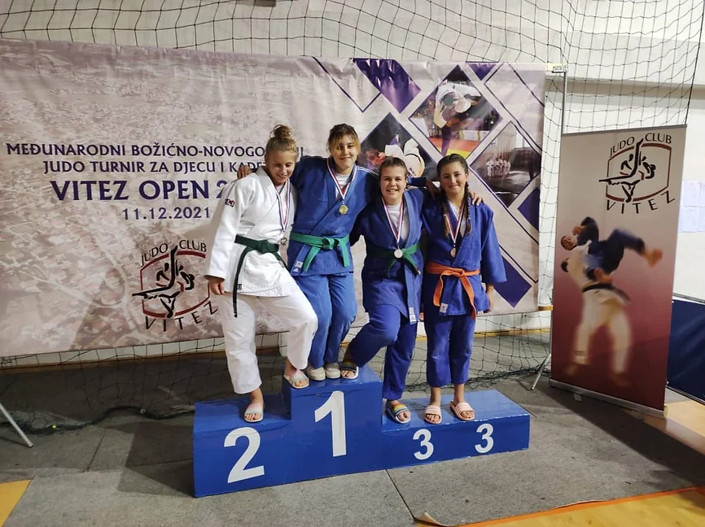

 
 
Dana 11. decembra 2021. godine održan je turnir "Vitez Open" u kojem je učestvovao veći broj naših takmičara u različitim uzrastima. Evo postignutih rezultata:

 
 

##### U11 dječaci

- Ismail Plavović (38kg)
    - 9. mjesto

- Benjamin Zuković (42kg)
    - 9. mjesto

##### U13 dječaci

- Faruk Beširević (42kg)
    - 2. mjesto (srebro)

- Ahmed Čopra (60kg)
    - 3. mjesto (bronza)

- Omar Firdus (55kg)
    - 7. mjesto

##### U13 djevojčice

- Nejra Žutić (+57kg)
    - 1. mjesto (zlato)

##### U18 djevojčice

- Nejra Plavović (57kg)
    - 3. mjesto (bronza)

##### U15 dječaci

- Faruk Beširević (42kg)
    - 2. mjesto (srebro)

- Ahmed Čopra (60kg)
    - 7. mjesto

- Emad Čoko (73kg)
    - 7. mjesto

##### U18 dječaci

- Ernad Makaš (73kg)
    - 7. mjesto

- Hamza Mujić (81kg)
    - 7. mjesto

Nejra Žutić je nakon teške povrede lakta pokazala veliki kvalitet i osvojila pehar za najbolju takmičarku turnira u uzrastu U13.
